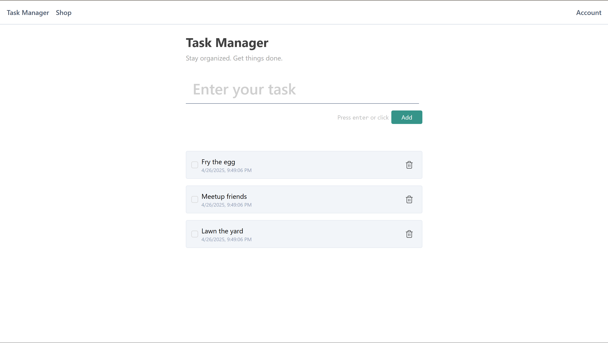
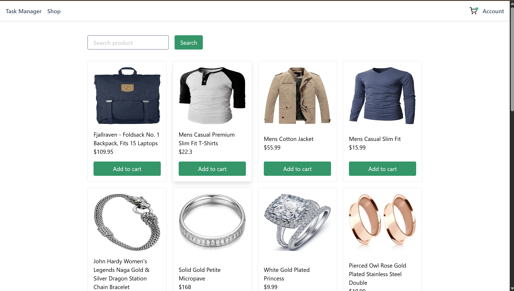
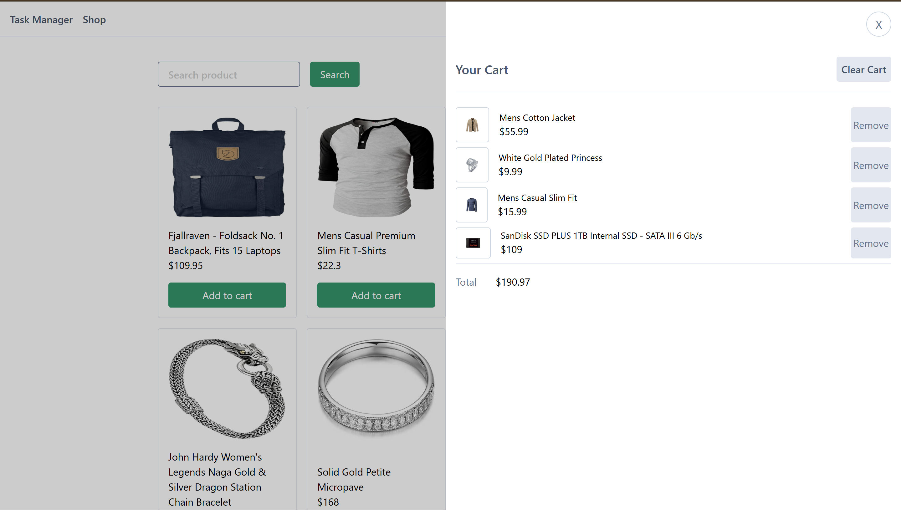
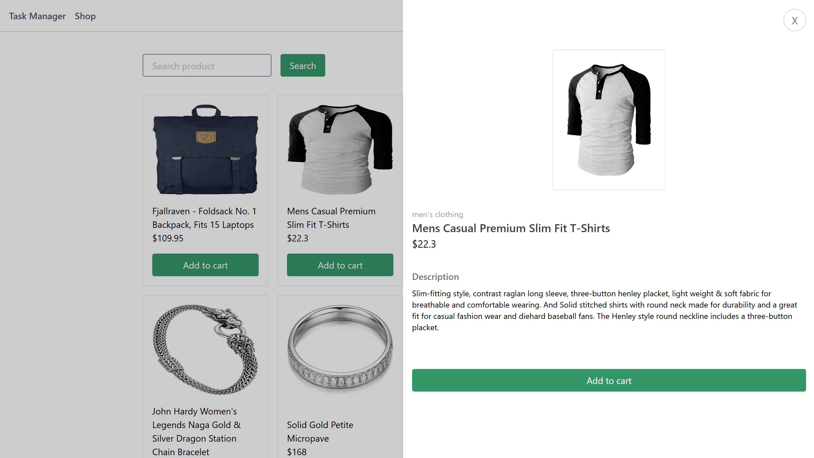
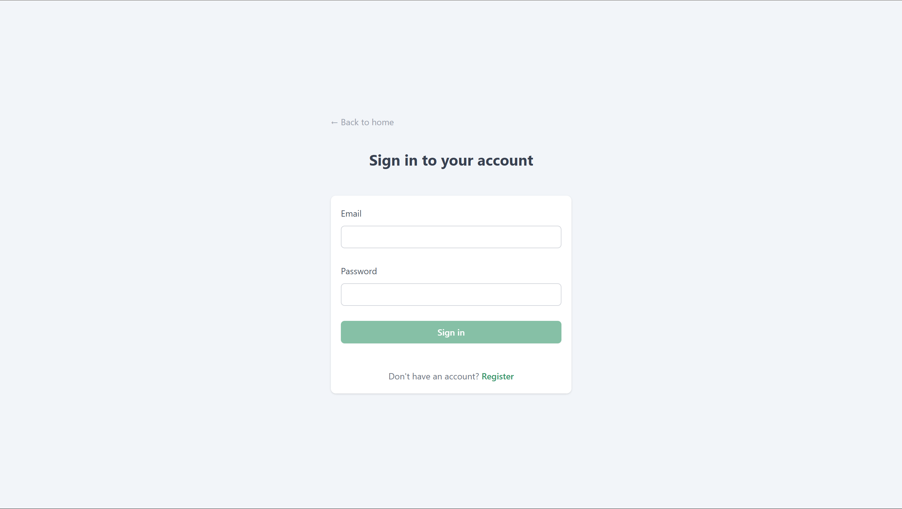
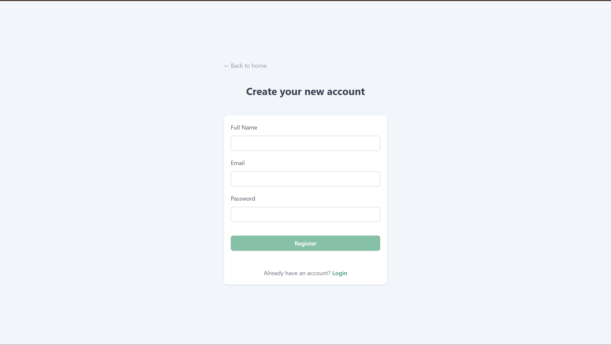
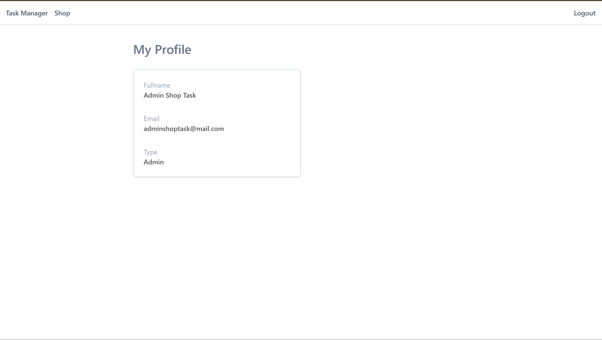

# Shop Task React

This is a website developed in React + Typescript + Vite and deployed to vercel

inside the website's consist of :

1. Task Manager [Task Manager Page](https://shop-task-react.vercel.app/)
2. E-Commerce [E-commerce page](https://shop-task-react.vercel.app/shop)
3. Account Authentication [login page](https://shop-task-react.vercel.app/login)

For deployed website you can visit here : https://shop-task-react.vercel.app/


## Installation step

Simply go to the directory and run these npm command to install and run the apps

```js
  npm run i
  npm run dev
```

## Task Manager


This is a simple task manager where we can manage task that needs to be done by typing to the input and submit to the list

On the task list, we can check if we complete the task and also delete it if the task is needed to be removed

## E-Commerce

A simple e-commerce page to display various products that i've fetched using https://fakestoreapi.com/

On this page, we can see the detail of the product, search the product and look up on the cart after we select one or several products





I implement a simple store using [Zustand](https://zustand-demo.pmnd.rs/) to manage data flow easily from display to our cart

## Account Authentication

In account authentication, i'm using localstorage to manage user data for register and login

simply make login credential as a token and it allows us to access profile page.
if token is not available, it'll throw us to the Task Manager Page

I've already make one dummy user for login, feel free to use it to login

```js
  email: adminshoptask@mail.com
  password: adminshop
```



